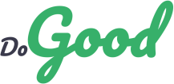

<h3 align="center">
    <br>
    <b>Vamos fazer o bem!</b> 🐱‍🏍
</h3>

<p align="center">
  <a href="https://rocketseat.com.br">
    </a>
    
</p>

<br>

## Projeto
O Do Good é uma plataforma que conecta ONGs que necessitam de algum tipo de ajuda, a pessoas que estão dispostas a ajudar.
Esse projeto foi desenvolvimento durante a Semana OmniStack 11.0, um evento da @Rocketseat, onde construimos uma aplicação completa com Node.js no back-end, ReactJS no front-end e React Native no mobile.

## Características
* A ONG poderá se cadastrar na aplicação.
* A ONG poderá fazer login na aplicação.
* A ONG poderá cadastrar casos e adicionar detalhes como descrição e o custo do caso.
* A ONG poderá disponibilizar o seu contato através de e-mail ou  whatsapp.
* O Usuário poderá ver os casos.
* O Usuário poderá entrar em contato com a ONG.

## Tecnologias utilizadas
Esse projeto foi desenvolvido com as seguintes tecnologias:
- [Node.js](https://nodejs.org/en/)
- [React](https://pt-br.reactjs.org/)
- [Express](https://expressjs.com/pt-br/)
- [KnexJS](http://knexjs.org/)
- [SQLite](https://www.sqlite.org/index.html)
  

## Como rodar o projeto
> OBS: pode-se utilizar o gerenciador de pacotes npm ou yarn para rodar os comandos abaixo

Execute ```yarn``` nas pastas backend e frontend para instalar as dependências.

Rode ```yarn start``` nas pastas backend e frontend. Acesse **localhost:3000**.

## Screenshots


---

<br>

<h4 align="center">by <b>Thiago Sousa</b> 🐱‍👤⚡</h4>
